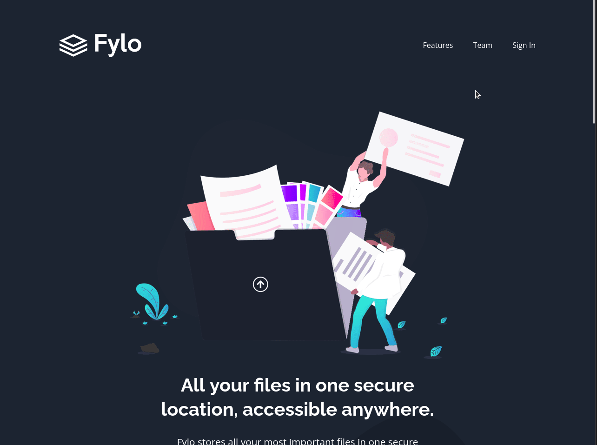

# Frontend Mentor - Fylo dark theme landing page solution

This is a solution to the [Fylo dark theme landing page challenge on Frontend Mentor](https://www.frontendmentor.io/challenges/fylo-dark-theme-landing-page-5ca5f2d21e82137ec91a50fd). Frontend Mentor challenges help you improve your coding skills by building realistic projects. 

## Table of contents

- [Overview](#overview)
  - [The challenge](#the-challenge)
  - [Screenshot](#screenshot)
  - [Links](#links)
- [My process](#my-process)
  - [Built with](#built-with)
  - [What I learned](#what-i-learned)
  - [Continued development](#continued-development)
  - [Useful resources](#useful-resources)
- [Author](#author)
- [Acknowledgments](#acknowledgments)

**Note: Delete this note and update the table of contents based on what sections you keep.**

## Overview

### The challenge

Users should be able to:

- View the optimal layout for the site depending on their device's screen size
- See hover states for all interactive elements on the page

### Screenshot

### Links

- Solution URL: [Frontend Mentor Solution](https://www.frontendmentor.io/solutions/first-time-using-sass-to-build-a-landing-page-comments-welcome-L6xHNEV5C)
- Live Site URL: [Github Page Site](https://your-live-site-url.com)

## My process

### Built with

- Semantic HTML5 markup
- CSS custom properties
- Flexbox
- Mobile-first workflow
- [Sass](https://sass-lang.com/) - Preprocessor language for CSS

### What I learned

This has been a very fun and interseting project to work on. While learning Sass
and using it in my first project was interseting, it was the accessibility issues
that I had and solve that feel like the most important things. Like making sure
when using a `<section></section>`to include a `aria-labelledby="pointing to a 
title tag"`. And having a **.sr-only** if, like in this project, I had an `<h2></h2>`
element that I need to hide but still need to use to label the seciton.

### Continued development

Continuing the use of Sass is somthing that I'm excited to learn and use more.

### Useful resources

- [CSS Reference](https://www.w3schools.com/cssref/default.asp) - This is great for looking up any CSS properties  This is great for looking up any CSS properties.
- [Sass 7-1 pattern](https://gist.github.com/rveitch/84cea9650092119527bc) - An example of the file system for Sass files.
- [Kevin Powell on Section Tags](https://www.youtube.com/watch?v=ULdkpU51hTQ&t=372s) - A quick run down of how to use the section tag with accessibility in mind.

## Author

- Website - [Kevinmullen.net](kevinmullen.net)
- Frontend Mentor - [@Kmullen444](https://www.frontendmentor.io/profile/Kmullen444)

